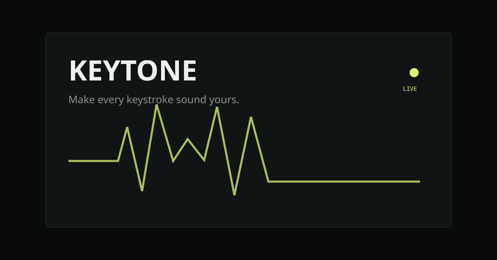
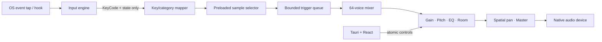

# Keytone

> **Make every keystroke sound yours.**

Keytone is a local-first, low-latency desktop keyboard audio engine. It listens for individual global physical-key events and turns them into layered, spatial mechanical-keyboard sound—entirely on your computer.



## Features

- Native global keyboard capture while Keytone is in the background
- Rust/CPAL real-time audio path with 64 overlapping voices
- Separate press and release samples, with repeat suppression
- Per-key/category sample variation and subtle pitch/gain randomization
- Physical keyboard-position stereo placement
- Live master, pitch, bass, treble, room and spatial controls
- Validated, local Keytone Sound Pack v1 folders
- Shareable JSON presets, local settings, tray controls and output selection
- Seven generated CC0 starter packs plus twelve MIT-licensed recorded switch packs
- No account, analytics, telemetry, database or network service

## Architecture



The audio callback does no disk I/O, JavaScript calls, blocking locks or per-frame allocation. Sound packs are decoded to mono floating-point sample buffers before playback. See [architecture.md](docs/architecture.md).

## Installation

Keytone v0.1 is currently source-distributed. Install the prerequisites below, then run the development build.

### Prerequisites

- Rust 1.77 or later
- Node.js 20 or later
- pnpm 10 or later
- Tauri 2 platform prerequisites for your OS

On Linux, install WebKitGTK 4.1, ALSA development headers, X11/XTest, AppIndicator and the standard [Tauri Linux prerequisites](https://v2.tauri.app/start/prerequisites/).

## Development

```bash
pnpm install
pnpm tauri dev
```

Checks used by CI:

```bash
cargo fmt --all -- --check
cargo clippy --workspace --all-targets -- -D warnings
cargo test --workspace
pnpm lint
pnpm typecheck
pnpm build
pnpm tauri build
```

Starter WAV files are installed into the application-data directory on first launch. Seven packs are synthesized from reproducible formulas; twelve recorded packs are adapted from the MIT-licensed [kbsim](https://github.com/tplai/kbsim) project. See [Third-party notices](THIRD_PARTY_NOTICES.md).

## Permissions

### macOS

Global key monitoring requires Input Monitoring access. Open **System Settings → Privacy & Security → Input Monitoring**, enable Keytone, then restart it. Keytone preflights this permission, requests it through the system API, and shows a visible warning when it is missing.

### Windows

Keytone uses the native global keyboard hook exposed by its input backend. Normal applications do not require elevation; elevated target applications can be isolated by Windows privilege rules.

### Linux

X11 capture uses the native event facilities. On Wayland, global input availability depends on compositor policy. Device-level setups may require membership in the `input` group. Keytone never attempts to bypass desktop security policy.

## Sound packs

Packs are data-only folders containing a `manifest.json` and WAV samples. They cannot execute code. Explicit per-key mappings override category mappings, which override `default`.

```text
my-pack/
├── manifest.json
└── samples/
    ├── press/default/01.wav
    ├── press/space/01.wav
    └── release/default/01.wav
```

See the complete [Sound Pack Specification v1](docs/sound-pack-spec.md).

## Creating a sound pack

1. Record or synthesize WAV files you have the right to redistribute.
2. Arrange them beneath `samples/press` and optionally `samples/release`.
3. Create a v1 `manifest.json` with relative paths only.
4. In Keytone, choose **Packs → Import pack** and select the folder.

Malformed, missing, unsupported and path-traversing assets are rejected without taking down the engine.

## Preset format

Packs contain raw audio; presets contain processing choices and a pack reference. Presets are versioned JSON intended to remain shareable. See [presets.md](docs/presets.md).

## Privacy

Keytone processes each physical key independently and immediately discards the event after scheduling sound. It does not record typed text, construct words, persist keyboard history, transmit events, use telemetry or require a network connection. See the [privacy and threat model](docs/privacy.md).

## Performance

Keytone prioritizes latency, then stability, then processing quality. A bounded lock-free queue connects input to a 64-voice callback. Development statistics report input-received → audio-event-queued scheduling time and queue drops. They do **not** claim output-device or acoustic end-to-end latency.

Hardware, driver, host buffer and operating-system scheduling determine the final perceived latency. The engine uses the device's default low-latency configuration and performs linear sample interpolation.

## Roadmap

- More native Wayland/libinput integration and device hotplug recovery
- Community pack registry and CLI (`search`, `install`, `use`)
- Sound Pack Studio for recording, segmentation and normalization
- Compressor, saturation and convolution reverb modules
- Optional authored/generative tools outside the real-time engine

## Contributing

Read [CONTRIBUTING.md](CONTRIBUTING.md) and our [Code of Conduct](CODE_OF_CONDUCT.md). Good first contributions include additional mock-backed input tests, accessibility improvements and legally clean CC0 packs.

## License

Keytone source is licensed under the [MIT License](LICENSE). The formula-generated demo packs are dedicated to the public domain under CC0-1.0. Recorded packs retain their upstream MIT license and attribution; see [Third-party notices](THIRD_PARTY_NOTICES.md).
# KeyTone
