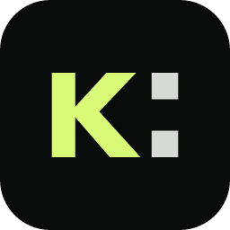
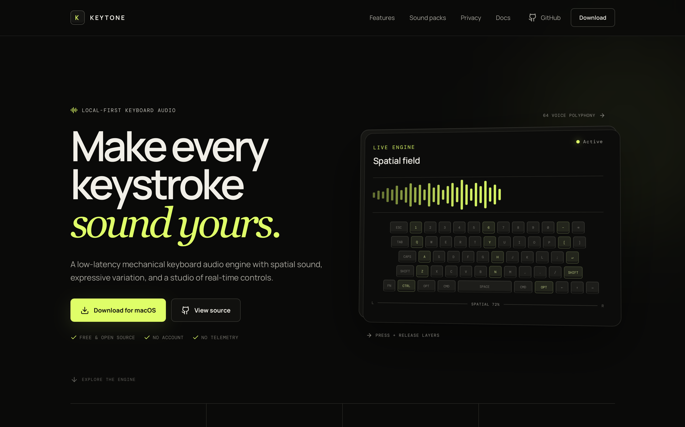
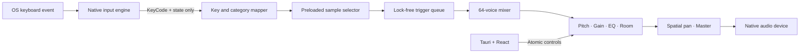

<div align="center">
  

  <h1>Keytone</h1>

  <p><strong>Make every keystroke sound yours.</strong></p>
  <p>A local-first, low-latency mechanical keyboard audio engine for macOS, Windows, and Linux.</p>

  <p>
    <a href="https://keytone.vercel.app/"><strong>Website</strong></a>
    ·
    <a href="https://github.com/Devesh36/KeyTone/releases/latest"><strong>Download</strong></a>
    ·
    <a href="docs/architecture.md"><strong>Architecture</strong></a>
    ·
    <a href="docs/sound-pack-spec.md"><strong>Sound Pack Spec</strong></a>
  </p>

  <p>
    <a href="https://github.com/Devesh36/KeyTone/actions/workflows/ci.yml"></a>
    <a href="https://github.com/Devesh36/KeyTone/releases/latest"></a>
    <a href="LICENSE"></a>
    
    
  </p>
</div>

<br>

<a href="https://keytone.vercel.app/">
  
</a>

<p align="center"><sub>Explore Keytone at <a href="https://keytone.vercel.app/">keytone.vercel.app</a></sub></p>

## Download

Keytone v0.1.0 is available as a native desktop application. Choose your platform or visit the [latest GitHub release](https://github.com/Devesh36/KeyTone/releases/latest) for every installer format.

| Platform | Download | Requirements |
| --- | --- | --- |
| macOS | [Universal DMG](https://github.com/Devesh36/KeyTone/releases/latest/download/Keytone_0.1.0_universal.dmg) | macOS 11+, Apple Silicon or Intel |
| Windows | [64-bit MSI](https://github.com/Devesh36/KeyTone/releases/latest/download/Keytone_0.1.0_x64_en-US.msi) | Windows 10+ |
| Linux | [64-bit AppImage](https://github.com/Devesh36/KeyTone/releases/latest/download/Keytone_0.1.0_amd64.AppImage) | Modern x86_64 distribution |

### Opening Keytone on macOS

> [!IMPORTANT]
> The current v0.1 macOS build is ad-hoc signed and not yet Apple-notarized. macOS may show **“Apple could not verify Keytone is free of malware.”** Only approve Keytone when you downloaded it from this repository's official release.

1. Try to open Keytone once. In the warning, click **Done**—not **Move to Bin**.
2. Open **System Settings → Privacy & Security**.
3. Scroll to the Security section and click **Open Anyway** beside the Keytone message.
4. Authenticate with Touch ID or your password, then click **Open**.
5. Enable Keytone under **Privacy & Security → Input Monitoring**, then fully restart the app.

Do not disable Gatekeeper globally. See [Apple's official Open Anyway instructions](https://support.apple.com/en-gb/102445) for more information.

On Linux, make the AppImage executable before launching it:

```bash
chmod +x Keytone_0.1.0_amd64.AppImage
./Keytone_0.1.0_amd64.AppImage
```

## Why Keytone?

Keytone transforms individual physical-key events into layered, spatial mechanical keyboard sound—entirely on your computer. It is designed as an audio engine first: the native Rust path handles input, sample selection, polyphonic mixing, DSP, and output without routing keystrokes through JavaScript.

- **Feels immediate** — samples are preloaded and scheduled through a bounded real-time queue.
- **Sounds natural** — multiple variations plus subtle pitch and volume randomization prevent robotic repetition.
- **Press and release layers** — every key can have a distinct downstroke and upstroke sound.
- **Spatial keyboard field** — left and right key positions translate into restrained stereo placement.
- **64 overlapping voices** — fast chords and rapid typing do not cut off previous sounds.
- **Live Sound Lab** — shape volume, pitch, bass, treble, room, randomness, and spatial strength while typing.
- **Nineteen included profiles** — generated CC0 packs and MIT-licensed recorded switch packs.
- **Local by design** — no account, cloud service, analytics, telemetry, or keyboard history.

## How it works



The audio callback performs no disk I/O, JavaScript calls, blocking locks, or per-frame allocation. Samples are decoded into in-memory floating-point buffers before playback. Read the full [architecture overview](docs/architecture.md).

## Sound packs

Keytone ships with a range of linear, tactile, clicky, and retro profiles, including Cream, Alpaca, Holy Panda, Box Navy, Topre, Blue Alps, and Cherry MX variants.

Packs are data-only directories. They contain a validated `manifest.json` and audio samples—never executable code. Explicit per-key mappings override category mappings, and category mappings fall back to `default`.

```text
my-pack/
├── manifest.json
└── samples/
    ├── press/
    │   ├── default/01.wav
    │   └── space/01.wav
    └── release/
        └── default/01.wav
```

To create your own:

1. Record or synthesize WAV files you have the right to distribute.
2. Arrange them under `samples/press` and, optionally, `samples/release`.
3. Add a versioned v1 `manifest.json` using relative sample paths.
4. Open **Packs → Import pack** in Keytone and select the folder.

See the complete [Keytone Sound Pack Specification v1](docs/sound-pack-spec.md). Included recorded packs retain their upstream licensing; see [Third-party notices](THIRD_PARTY_NOTICES.md).

## Presets

Sound packs provide raw samples. Presets store the active pack and processing configuration separately, including master volume, pitch, randomness, EQ, reverb, and spatial strength. Presets are local, versioned JSON designed to remain shareable.

See the [preset format](docs/presets.md).

## Permissions

### macOS

The current release may require the one-time [Open Anyway procedure](#opening-keytone-on-macos) described above. Global key monitoring separately requires **Input Monitoring** access. Open **System Settings → Privacy & Security → Input Monitoring**, enable Keytone, then fully restart the app. Keytone preflights this permission and shows a visible warning when it is missing.

### Windows

Keytone uses a native global keyboard hook. Normal applications do not require elevation; Windows privilege isolation can prevent a normal process from observing an elevated application.

### Linux

X11 capture uses native event facilities. On Wayland, global-input availability depends on compositor policy. Some device-level setups require membership in the `input` group. Keytone never attempts to bypass desktop security policy.

## Privacy

Keyboard monitoring deserves a clear boundary. Keytone:

- processes one physical key event at a time;
- schedules its sound and immediately discards the event;
- never constructs words or records typed text;
- never stores keyboard history;
- never transmits keyboard activity;
- contains no telemetry or analytics; and
- requires no network connection to run.

Read the full [privacy and threat model](docs/privacy.md).

## Development

### Prerequisites

- Rust 1.77 or newer
- Node.js 20 or newer
- pnpm 10 or newer
- Tauri 2 prerequisites for your operating system

On Linux, install WebKitGTK 4.1, ALSA development headers, X11/XTest, AppIndicator, and the standard [Tauri Linux prerequisites](https://v2.tauri.app/start/prerequisites/).

### Run the desktop app

```bash
git clone https://github.com/Devesh36/KeyTone.git
cd KeyTone
pnpm install
pnpm tauri dev
```

### Run the landing page

```bash
pnpm web:dev
```

The site is a separate Vite application in `apps/website`. Its platform buttons discover matching installer assets from the latest GitHub Release. The production deployment is available at [keytone.vercel.app](https://keytone.vercel.app/).

### Verify the workspace

```bash
cargo fmt --all -- --check
cargo clippy --workspace --all-targets -- -D warnings
cargo test --workspace
pnpm lint
pnpm typecheck
pnpm build
pnpm tauri build
```

## Project structure

```text
keytone/
├── apps/
│   ├── desktop/          # Tauri 2 + React desktop interface
│   └── website/          # Public Vite landing page
├── crates/
│   ├── keytone-core/     # Settings, key model, layout
│   ├── keytone-input/    # Global input and normalization
│   ├── keytone-audio/    # CPAL stream and voice mixer
│   ├── keytone-dsp/      # Real-time effects
│   └── keytone-packs/    # Pack validation and selection
├── packs/                # Redistributable sound packs
├── docs/                 # Specifications and design docs
└── tools/                # Reproducible asset tooling
```

## Performance

Keytone prioritizes latency, then stability, then processing quality. Development statistics measure input received → audio event queued scheduling time and queue drops. They do **not** claim output-device or acoustic end-to-end latency.

Final perceived latency depends on the audio device, driver, host buffer, and operating-system scheduling. The engine requests the device's default low-latency configuration and uses linear interpolation for pitch changes.

## Roadmap

- More native Wayland/libinput integration and device hotplug recovery
- Community pack registry and CLI (`search`, `install`, `use`)
- Sound Pack Studio for recording, segmentation, and normalization
- Compressor, saturation, and convolution reverb modules
- Optional authored and generative tools outside the real-time engine

## Contributing

Contributions are welcome. Read [CONTRIBUTING.md](CONTRIBUTING.md), the developer notes in [docs/contributing.md](docs/contributing.md), and the [Code of Conduct](CODE_OF_CONDUCT.md) before opening a pull request.

Good first contributions include mock-backed input tests, accessibility improvements, documentation, and legally clean CC0 sound packs.

## License

Keytone source is licensed under the [MIT License](LICENSE). Formula-generated demo packs are dedicated to the public domain under CC0-1.0. Recorded packs retain their upstream MIT license and attribution; see [Third-party notices](THIRD_PARTY_NOTICES.md).
