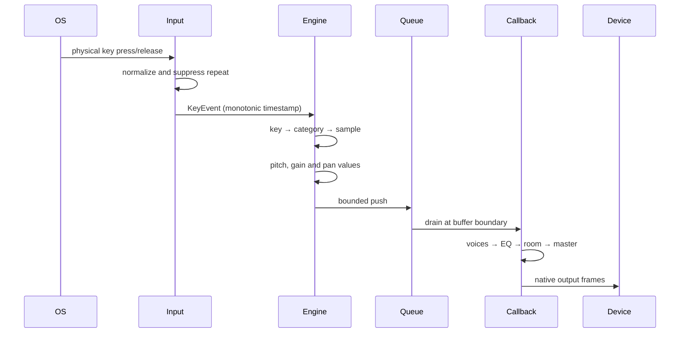

# Architecture

Keytone separates the reusable engine from its Tauri control surface.

```text
apps/desktop              React UI and Tauri process lifecycle
crates/keytone-core       Physical keys, settings and presets
crates/keytone-input      Native global event adapter and normalization
crates/keytone-packs      Safe manifests, eager WAV decoding and selection
crates/keytone-dsp        Atomic parameters and allocation-free processing
crates/keytone-audio      CPAL stream, trigger queue and 64-voice mixer
```

## Event lifecycle



The event contains a physical `KeyCode`, state and monotonic timestamp. It contains no printable character. The input thread does not aggregate events.

## Real-time contract

The CPAL callback:

- never reads the filesystem;
- never invokes JavaScript or IPC;
- owns 64 preallocated voice slots;
- drains a bounded `ArrayQueue` without locking;
- reads effect parameters from relaxed atomics;
- performs no per-frame heap allocation; and
- clips output safely before device conversion.

Sample buffers are reference-counted, but the active pack retains them, so retiring a voice in the callback does not deallocate the underlying audio.

## Failure boundaries

Pack loading and validation happen away from the callback. Switching packs is atomic, and queued voices retain their samples. A device stream failure updates status without panicking. Invalid settings fall back to defaults and produce a visible warning. Input permission failure does not take down the UI or audio device.

## Extension points

`InputBackend` can be replaced with more specialized Raw Input, CGEventTap or evdev adapters. DSP modules operate on stereo frames and can later host compression or saturation. Packs and presets remain distinct, allowing a future registry to distribute raw packs independently of user processing.
